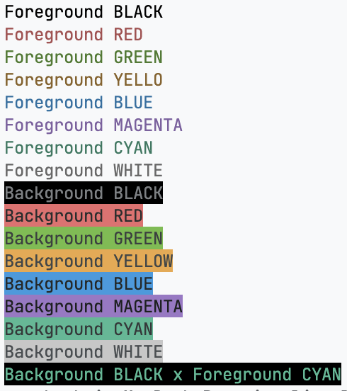

# zig-cli-color

## Build

```bash
zig build -Doptimize=ReleaseFast
```

## Run

```bash
zig build run
```



## Usage

```zig
const std = @import("std");
const Color = @import("color.zig").Color;

var allocator = std.heap.page_allocator;
var color = Color.init(allocator);
defer color.deinit();

std.debug.print("{s}{s}\n", .{ color.fgBlack("Foreground BLACK"), color.reset() });
```